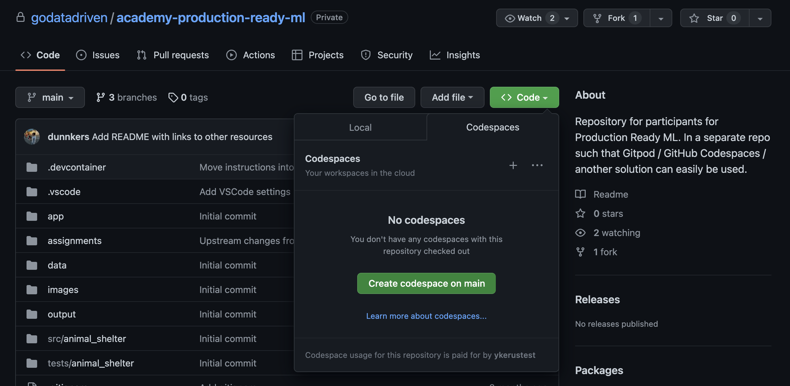

# Production Ready Machine Learning

Hi! 👋🏻

This repository contains the material needed for the "Production Ready Machine Learning" training.

Since you're reading this, it means you've successfully gained access to this repo 🎉. Now let's get you all setup for the training.

## Getting Started

We advise to walk through the following steps _before_ the actual training, so we can catch any potential problems in time.
If you run into problems, please contact your trainer so that we can help out.

If you have a local Python installation and you can set up Jupyter and Poetry, you can just clone this repository. You will be able to follow the training using your own setup and the editor of your choice.

Alternatively, we provide a _devcontainer_ that spins up a virtual environment with everything ready for the training using VS code as an editor.
The steps to set this up are:

1. ✅ Access the repository
2. Open or create a _codespace_ on the `main` branch. This will open a new browser tab with a browser version of VS code. It will take a few minutes to set up, but eventually you 

   > [Codespaces](https://docs.github.com/en/codespaces/overview) allow you to work on a repository on a computer other than your own, saving you from the trouble of setting everything up yourself.
   

3. (Optional) You can access the _codespace_ in your local version of VS Code Desktop. To do so, open the command palette in VS Code you have opened in your browser. To open the command palette, on Mac the shortcut is `⌘+SHIFT+P`, on Windows and Linux it is `Ctrl+Shift+P`. From the command palette, select "Codespaces: Open in VS Code Desktop", and follow the steps to open VS Code locally. 
4. You should now have access to the code, in your personal codespace, in your locally installed VS Code Desktop. To make sure everything is setup correctly you can:
   - Inspect the bottom left corner, which should say "Codespaces" (may be located elsewhere in the Windows version)
   - Open a terminal in VS Code and run `python -V`, which should return a Python version >= 3.9.
   - Run `poetry -V`, which should return any version of Poetry.

That's it! You should be all setup now.
You can close VS Code and the tabs you have opened in your browser, and start it up again during the training.

## About

Xebia Data (c) 2024.
